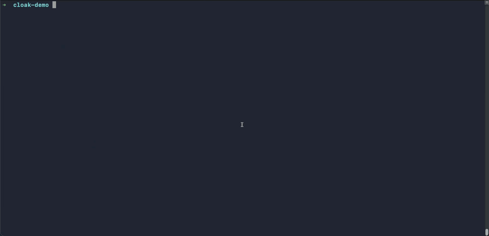

# Cloak

[](https://github.com/hoophq/cloak/releases)
[](https://github.com/hoophq/cloak/actions/workflows/ci.yml)
[](https://pkg.go.dev/github.com/hoophq/cloak)
[](LICENSE)

**Hand your AI agent a fake credential; keep the real one out of its context.**

The moment an agent holds a real DSN or API key, that secret is in its context
window, logs, and traces — the places nobody rotates secrets out of. Cloak is a
tiny local proxy: it hands the agent a **fake** credential pointing at
`localhost` and swaps in the real one on egress, over verified TLS, loaded from
your OS keychain. The agent never sees it.

Works today for **PostgreSQL** and **HTTP APIs** (OpenAI, Anthropic, and
anything taking a bearer token or API-key header).

## Install

**macOS (Homebrew):**

```console
brew install hoophq/tap/cloak
```

**macOS / Linux (script):**

```console
curl -fsSL https://raw.githubusercontent.com/hoophq/cloak/main/install.sh | sh
```

Signed binaries on [releases](https://github.com/hoophq/cloak/releases); or
`go install github.com/hoophq/cloak@latest` (Go 1.26+).

## Setup — point cloak at your `.env`

```console
$ cloak import .env
→ DATABASE_URL (line 1): upstream "database-url" on 127.0.0.1:5433, credential moves to the OS keychain
→ OPENAI_API_KEY (line 2): upstream "openai-api-key" on 127.0.0.1:5434, credential moves to the OS keychain
Rewrite .env? [y/N] y
✓ imported 2 credential(s); .env rewritten (original backed up)
```

The real secrets move to your keychain; the `.env` is rewritten to **fakes** — a
loopback DSN and a `cloak-…` key that only resolve through cloak. It recognizes
Postgres DSNs and common LLM providers (OpenAI, Anthropic) on sight. Undo with
`cloak import --undo .env`.

Need something import doesn't recognize (a custom host, an odd env name)?
Register it by hand — same keychain, same fakes:

```console
$ cloak add openai --type http --host api.openai.com --auth bearer \
    --env OPENAI_API_KEY --env-url OPENAI_BASE_URL
```

## Use it — set up once, then forget it

### Agents (Claude Code)

```console
$ cloak init      # wire cloak into Claude Code, once
$ claude          # a 🔒 banner confirms it's on
```

Ask the agent to print `$OPENAI_API_KEY` and it sees `cloak-…`, never your real
key — while its requests still reach OpenAI with the real one swapped in.


### Your own application

```console
$ cloak start     # run cloak as a background service, once
$ python app.py   # run your app normally — no prefix, no wrapper
```

Your app loads the rewritten `.env` and talks to `localhost`; cloak swaps in the
real credentials on the way out. `cloak status` shows what's live, `cloak stop`
tears it down. Just need a one-off? `cloak run -- python app.py` serves a single
command, then exits.



Add a credential later and cloak resyncs itself — the running daemon and Claude
Code both pick it up, no `cloak init` re-run needed.

> LangChain or another framework? It delegates to the same SDKs — see the
> [integration guide](docs/INTEGRATIONS.md).

## What it protects — and what it doesn't

Cloak keeps the real credential out of the agent's context, logs, and traces; a
leaked fake is worthless off-box and dies with the session. It does **not** stop
a prompt-injected agent from *misusing* the live access while the proxy runs —
**it protects the credential, not the access.** Pair it with your agent's
sandboxing. The [threat model](docs/THREAT_MODEL.md) is honest about the limits.

Cloak is also **local self-protection**: one developer, one machine, your
keychain. Need credentials brokered for a whole team — with access controls,
approval workflows, and an audit trail no laptop can switch off? That's a
different trust model, and it's what
**[hoop.dev](https://hoop.dev/start?utm_source=cloak&utm_medium=github&utm_campaign=att-launch-072026)**
does. Same idea, enforced at the gateway instead of on the laptop.

## Docs

- **[Integration guide](docs/INTEGRATIONS.md)** — Claude Code, MCP servers, agentic backends, CI.
- **[Threat model](docs/THREAT_MODEL.md)** — what it protects, what it doesn't, and why.
- **[FAQ](docs/FAQ.md)** — why not env vars or a secrets manager.

Other commands: `cloak list`, `cloak rm <name>`, `cloak status` · `cloak --help`.

## Development

```console
make build   # build the binary
make test    # unit tests
make e2e     # full broker path against real PostgreSQL (Docker)
```

## License

MIT © [hoop.dev](https://hoop.dev/?utm_source=cloak&utm_medium=github&utm_campaign=att-launch-072026) — built by the team behind hoop.
